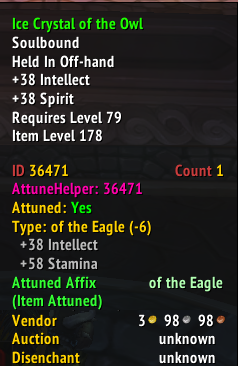

# AttuneHelper

A simple addon to add some QOL for attunements

Features:
- More detailed attunement information in tooltip

## Dependencies

- [SynastriaCoreLib](https://github.com/imevul/SynastriaCoreLib/releases) (Optional)

## Installation

1. Download the [latest release](https://github.com/imevul/AttuneHelper/releases)
2. Extract to Interface/AddOns and enable the addon in-game

# Examples

